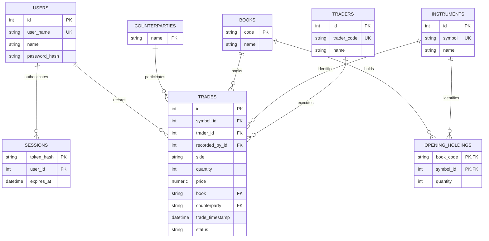

# Trade Blotter

A simplified equity trade blotter built with React, TypeScript, Express, and
PostgreSQL. Users can view, sort, filter, create, amend, and cancel trades.
Authenticated WebSocket connections deliver trade updates and editing presence.

## Run locally with Docker

Requires Docker with Compose. Run from the repository root; Node and npm are
installed inside the images.

One-time setup, only if root `.env` does not already exist:

```sh
cp .env.example .env
```

Edit the ignored root `.env` and set `SEED_RECORDER_PASSWORD` to your own password
of 12–1,024 characters for demo login. Leave an existing `.env` in place rather
than copying over it. Docker reads root `.env`, not `backend/.env`.
Single-quote values containing `$` or `#` so Compose treats them literally.

Build and start everything:

```sh
docker compose up -d --build --wait
```

Open **http://localhost:8080** and log in as **seed-recorder**. Docker builds the
frontend, starts PostgreSQL, runs migrations, seeds 1,000 trades on an empty
blotter, and waits for the API and Nginx health checks. The API and WebSocket
connections are served through `/api`; no separate frontend build or migration
command is needed. Startup never resets an already enabled account's password.

Useful commands:

```sh
docker compose ps -a
docker compose logs -f api frontend
docker compose down
```

Stopping retains database data. `docker compose down -v` deletes it. After code
changes, rerun `docker compose up -d --build --wait`. After migration changes,
add `--force-recreate` so the migration service runs again. Containers serve a
compiled frontend; use the host development option below for hot reload.

To test with two users, follow the [reviewer walkthrough](docs/reviewer-testing.md):
create a second account with a hidden password prompt, use normal and private
browser windows, and check live updates, editing presence, last save wins,
cancellation, and reconnect recovery.

If port 8080 is occupied, change `WEB_PORT` and `WS_ALLOWED_ORIGINS` together in
`.env`. PostgreSQL is bound to loopback on port 5432; change `POSTGRES_PORT` if
another database uses that port. The API has no published host port.

For a quick demo, select a symbol card, set dates to compare price and share
activity, then create or amend a trade. Open a second browser tab to see live
updates and editing indicators. Clearing dates restores the complete charts and
blotter; position totals always include all dates.

### Local Development

For hot reload, run PostgreSQL in Docker and the API/frontend on your computer.
Requires Node.js 24 and npm. From the repository root, install dependencies and
create the backend environment file once (skip the copy if it already exists):

```sh
npm ci --prefix backend
npm ci --prefix frontend
cp backend/.env.example backend/.env
docker compose up -d --wait db
```

Before starting the API, edit the ignored `backend/.env` and set
`SEED_RECORDER_PASSWORD` to your own password of 12–1,024 characters. This enables
login as **seed-recorder** without a separate provisioning step. There is no
hardcoded password, and credentials are never printed or prefilled in the UI.
Do not commit the real environment file.
Set `WS_ALLOWED_ORIGINS=http://localhost:5173,http://127.0.0.1:5173` for Vite.
Apply migrations before the first API start:

```sh
npm --prefix backend run migrate -- up
```

Start the API:

```sh
npm --prefix backend run dev
```

In another terminal, start the frontend:

```sh
npm --prefix frontend run dev
```

Open the URL Vite prints (normally `http://localhost:5173`), log in as
`seed-recorder`, and open the dashboard. The API listens on port 3000; Vite proxies
`/api` requests and WebSocket upgrades to it. If Vite selects another port, add its
exact browser origin to `WS_ALLOWED_ORIGINS` in `backend/.env` and restart the API.

The example connection string uses the default local PostgreSQL credentials.
If you change database credentials or ports, update `DATABASE_URL` in
`backend/.env` to match. `npm --prefix backend start` runs the API without watch mode.

## Startup data and accounts

After migrations, API startup persists exactly **1,000 randomized trades when the
blotter is empty**, before accepting HTTP or WebSocket connections. A nonempty
blotter is never replaced or topped up. Initialization uses one transaction and
serializes concurrent startup seeders; failure rolls back and stops startup.

The dataset includes five equity symbols, 26 trader codes, BUY/SELL sides,
positive quantities/prices, three books, five counterparties, weekday execution
times within the previous 30 days, and approximately 10% CANCELLED trades. Prices
are simulated demo values, not market quotes. PostgreSQL generates unique IDs.
Existing instrument and trader names are preserved.

With `SEED_RECORDER_PASSWORD` configured, fresh seeds belong to `seed-recorder`.
Startup creates that account or enables it if its password is `LOGIN_DISABLED`,
including on a nonempty blotter. It **never resets an existing enabled password**.
Changing the environment value alone therefore does not rotate a password.
Existing trades keep their original recorder metadata.

Without the secret, startup uses the first existing recorder by ID. If no account
exists, it creates `seed-recorder` with login disabled. Enable or rotate its
password explicitly through the Docker CLI:

```sh
docker compose exec api sh /usr/local/bin/backend-entrypoint node scripts/create-user.ts --username seed-recorder --reset-password
```

To create another account:

```sh
docker compose exec api sh /usr/local/bin/backend-entrypoint node scripts/create-user.ts --username recorder --name "Trade Recorder"
```

For host development, use `npm --prefix backend run user:create --` with the
same arguments instead. The CLI requires an interactive terminal, reads the
password without echoing,
and revokes existing sessions when resetting a password. No registration endpoint
or separate seed command is provided.

## Using the blotter

- `/` leads to `/login`; authenticated users are redirected to `/dashboard`.
- `/dashboard` requires a verified session and contains the trade blotter.
- `/logout` clears local authentication and revokes the server session. Failed
  server revocation offers a retry.
- Unknown paths show a not-found page. Route failures have an error fallback.

The table supports sorting, pagination, BUY/SELL, date and field filters, Active
only, and manual Refresh. Execution timestamps are displayed and entered in UTC.
Create trade opens a nonmodal drawer; the dashboard remains interactive and outside
clicks do not dismiss it. The create draft survives closing; successful saves clear
it. Edit opens the same form populated from the selected trade. Closing the edit
drawer discards its draft. Symbol, trader, book, and counterparty options come from
the API.

Any authenticated user can amend or cancel an ACTIVE trade. Cancellation retains
the record with CANCELLED status. Cancelled trades cannot be amended or cancelled
again. `recordedById` identifies the original creator and never changes on amendment.
Successful amendments use **last save wins**. Database row locks ensure an
amendment cannot overwrite cancellation and revive a trade.

New trades wait behind **Show new trades (N)** so the current page stays stable.
Showing them resets filters/sorting, returns to page 1, and keeps the page size.
New active rows fade green and retain a green dot until full refresh; amendments
fade blue, and cancelled rows are visually muted.

An orange dot identifies trades currently open for editing, with editor names in
its tooltip. The drawer identifies other editors, preserves its draft when the
cached trade changes, and warns that saving will overwrite newer values. If the
trade is cancelled, Save is disabled and the draft is retained. Editing presence
is informational: it never locks trades or blocks another user's save/cancellation.

### Position summary and book references

Books and counterparties have their own reference tables; dropdown options
include configured entries whether or not they have trades. Submitted book codes
and counterparty names must exist. Opening holdings
are stored separately for each book/instrument pair and represent holdings before
all recorded trades, not a rolling balance or a cash account.

The initially open, collapsible summary shows **symbol position cards across all
books and dates**, with current quantity, estimated value, and quantity-weighted
average execution price. Secondary metrics show Opening quantity, Bought, Sold,
and Net traded:

**Current position = Opening quantity + active BUY quantities - active SELL quantities.**

Cancelled trades are excluded. Opening holdings remain visible without any active
trades, and a pair without an opening holding starts at zero. Date and table filters
never change the cards' quantities or price references. New cached trades contribute
before Show new trades reveals their rows. Unsaved drafts do not count.

The date controls below the cards filter only the charts and table, using inclusive
UTC execution dates. The header's Refresh reloads trades and opening holdings
while preserving dates and symbol selection. Holdings use one cached reference
request; normal live updates reuse it and recalculate from the existing trade cache.
No extra requests are added per event. No cash limits, P&L accounting, or sell
restrictions are enforced; negative positions are allowed. Opening holdings are
configured in the database/seed, with no management UI.

Symbol cards are the shared symbol control for both charts and the blotter. Selecting a
card retains dates, clears other table filters, and returns to page one, retaining
sorting and page size. Select it again or use **All symbols** to clear selection.
The table's additional filters contain traders, books, and counterparties. Reset
clears all filters including dates; Clear dates clears only the chart/table date
range. Confirmed quantity changes show a signed indicator for four seconds.

**Valuation trade-off:** there is no external market-data feed. Each symbol's
weighted-average execution price is sum(price × quantity) / sum(quantity) over
all active buys and sells, across books and dates. Estimated value multiplies this
reference by current quantity. This is an execution-price valuation proxy, not live
market value, average acquisition cost, remaining-position cost basis, or P&L.
Amendments and cancellations recalculate the reference; missing prices show
Unavailable. Opening holdings have no acquisition costs. Demo prices are USD.

In **Create trade**, selecting a symbol shows its latest active execution price and
UTC timestamp, ordered by execution timestamp with trade ID breaking ties. The
**Use last price** button explicitly copies that reference into the price field.
Typing a price, changing symbols, or receiving live updates never automatically
replaces the entered price. Amendment drawers retain the original trade price.

The **Execution price history** chart shows a daily quantity-weighted execution
price per symbol using active trades within the date range. It aggregates noisy
executions without smoothing or creating market prices. Days without trades are
connected. Focus a point and use arrow keys to inspect daily prices, quantities,
and execution counts. Pointer movement selects the nearest day across the plot,
coalesced to one update per animation frame; geometry and labels are cached.
These are blotter analytics, not a trading simulator or an audit history.

The **Daily share activity** chart shows shares bought above zero and shares sold
below zero for each UTC execution day. Hover a bar, or focus the chart and use
arrow keys, to inspect bought, sold, net change (bought minus sold), and execution
count. Both charts share the symbol/date controls and update from the trade cache
after confirmed saves, cancellations, and live events, without additional reads.
Cancelled trades and opening holdings do not contribute to daily activity.

**Activity assumptions and trade-offs:** All symbols combines share counts across
instruments to show gross workload; select a symbol for its quantity movement.
These totals are not economic exposure, turnover value, or a historical balance.
Sells use a negative plotting direction but the sold quantity itself is positive.
Days without executions have no bars. A buy and sell of equal quantity remain
visible even though net movement is zero. Price and share charts remain separate
so each has one unit and scale. Historical charts reflect current trade records:
amending or cancelling an older trade revises that day's analytics; there is no
immutable audit history or settlement accounting.

The `books-and-opening-holdings` migration **truncates existing demo trades once**
and resets trade IDs. It retains accounts/passwords. API startup then seeds 1,000
trades using valid book references and 15 randomized opening holdings (three books
× five instruments, 50,000–200,000 shares each). Subsequent startups preserve
nonempty data and existing opening quantities. Migration rollback does not restore
the discarded trades.

## Architecture and real-time updates

```text
frontend/           React UI, Redux Toolkit, RTK Query, typed HTTP/WebSocket clients
backend/src/        Express routes, services, repositories, auth, startup, WebSockets
backend/db/         PostgreSQL connection and versioned schema migrations
backend/test/       Database integration tests using isolated schemas
deploy/             Nginx reverse proxy and SPA fallback configuration
docs/realtime.md    WebSocket protocol, lifecycle, and deployment notes
AI_USAGE.md         AI usage report, representative prompts, and my amendments
```

Database source is in `backend/db`; there is no separate top-level database project.
Routes validate inputs with Zod and translate feature errors into HTTP responses.
Services handle workflow rules and response mapping. Repositories use parameterized
SQL; PostgreSQL constraints protect persisted values and references. Unexpected
errors return generic responses without SQL or credentials.

Redux Toolkit owns shared application state. RTK Query caches reads and applies
confirmed mutation responses. HTTP writes remain authoritative. A write revision
prevents older list responses from erasing confirmed changes and schedules a
follow-up refresh when needed.

The default WebSocket adapter obtains a 30-second single-use ticket through the
bearer-authenticated `/api/ws/ticket` endpoint. The server validates the ticket,
session, and allowed Origin before accepting `/api/ws`. Each committed write
publishes `trade.changed`; clients fetch only the affected trade. Reconnects refresh
the full list to recover missed changes. The first connection reuses an in-flight
initial load; if that load has already finished, it requests a fresh snapshot.

Editing presence is tracked per connection, broadcast independently, and does not
trigger trade reads. It is cleared on close/session rejection; heartbeat cleanup
removes dead connections. The open drawer announces presence again after reconnect.
The client retries disconnected connections after three seconds with a fresh ticket.
See [the WebSocket contract](docs/realtime.md) for event shapes and close codes.

## HTTP API and authentication

All backend routes require the `/api` prefix. Unprefixed backend paths return JSON 404s.

| Method | Path | Behavior |
| --- | --- | --- |
| GET | `/api/health` | Health response |
| GET | `/api/trades?limit=100&offset=0` | Trades and pagination metadata |
| GET | `/api/trades/:id` | Trade by formatted or numeric ID |
| GET | `/api/trades/options` | Symbol/trader/book/counterparty options |
| GET | `/api/instruments` | Instrument symbols and names |
| GET | `/api/traders` | Trader codes and names |
| GET | `/api/books` | Configured book codes and names |
| GET | `/api/counterparties` | Configured counterparty names |
| GET | `/api/positions/opening` | Opening holdings: `{ book, symbol, quantity }[]` |
| POST | `/api/trades` | Create; authentication required |
| PATCH | `/api/trades/:id` | Amend; authentication and ACTIVE status required |
| PATCH | `/api/trades/cancel/:id` | Cancel; authentication and ACTIVE status required |
| POST | `/api/auth/login` | Username/password to bearer session |
| GET | `/api/auth/me` | Authenticated user |
| POST | `/api/auth/logout` | Revoke bearer session; returns 204 |
| POST | `/api/ws/ticket` | Authenticated connection ticket |

Creation and amendment accept `symbol`, `trader`, `side`, `quantity`, `price`,
`book`, `counterparty`, and ISO UTC `tradeTimestamp`. Quantity must be a positive
integer up to 2,147,483,647; price must be finite and positive. Unknown symbols,
traders, book codes, counterparty names, and properties are rejected. Creation assigns ACTIVE status and the
recorder from authentication. Writes return the complete flat trade; creation
returns 201 and amendment/cancellation return 200. Missing trades return 404;
cancelled-trade changes return 409.

List responses use `{ trades, pagination: { limit, offset, total } }`. Limit defaults
to 100 (maximum 100), and offset to zero. Results are ordered by execution time,
then ID, descending. The UI loads all pages and sorts/filters locally. Errors use
`{ error, code, fieldErrors? }` with appropriate HTTP status codes.

Sessions expire after eight hours. Tokens contain 256 bits of randomness and are
stored as SHA-256 hashes in PostgreSQL. Passwords use salted asynchronous scrypt.
Login is limited to ten attempts per IP per fifteen minutes; ticket requests are
limited to thirty per minute. Send `Authorization: Bearer <token>` for protected
requests. Multiple sessions are allowed.

The browser stores the session in `localStorage`, verifies restored sessions,
and synchronizes login/logout across tabs. Passwords are never stored there.
The UI requires login even though trade/reference GET endpoints are public.
WebSockets recheck sessions before notifications and during the 30-second heartbeat.

## Database model



## Tests and checks

```sh
npm --prefix backend run test:unit
npm --prefix frontend test
npm --prefix backend run typecheck
npm --prefix frontend run typecheck
npm --prefix frontend run build
npm --prefix backend run lint
npm --prefix frontend run lint
```

For database integration tests, create the dedicated test database once and copy
its environment example. Do not use the development database for these tests.

```sh
docker compose exec db createdb -U trading trading_test
node -e "const fs = require('node:fs'); if (!fs.existsSync('backend/.env.test')) fs.copyFileSync('backend/.env.test.example', 'backend/.env.test');"
npm --prefix backend run test:integration
```

If local PostgreSQL credentials differ, adjust `TEST_DATABASE_URL` in the ignored
`backend/.env.test`. Its database name must end in `_test`. Each integration file
creates, migrates, and removes its own schema. Tests cover persistence, startup
seeding/provisioning, authentication, shared trade management, rollback, and
amend/cancel concurrency. WebSocket tests use real connections with mocked session
I/O; frontend tests cover cache recovery, presence, drawer drafts, and trade actions.

Biome configuration is shared at the repository root. `lint:fix` applies safe lint
fixes, `format` writes formatting, `format:check` checks it, and `check` runs combined
lint/format checks in either package. These are separate from type checking.

## Assumptions and trade-offs

- Trades have already been executed elsewhere; order submission and matching are
  outside this application's scope. BUY/SELL refer to the named trader's book.
- Counterparty represents the institution on the other side; its opposite side is
  implied. Trader and recorder are separate identities.
- Execution time is distinct from entry time. Currency and live market quotes are
  not modeled.
- Local sorting/filtering and offset pagination suit the 1,000-trade demo. Offset
  pages can shift during concurrent writes; reconnect/manual refresh recovers state.
- Last save wins avoids a version/conflict workflow. Presence provides awareness,
  and cancellation remains enforced by the database transaction.
- Tickets, presence, rate limits, and event broadcasting are process-local. Run one
  API process; multiple workers require shared ticket storage and event delivery.
- Events have no durable replay. Reconnect refetches recover missed committed state;
  there is a small crash window between database commit and event publication.
- Sessions use browser storage and bearer authentication; there are no refresh
  tokens or role permissions. Audit history and P&L are not implemented; positions combine opening holdings with active recorded quantities.

## Deployment preparation

Local Docker startup is described above. Deployment remains a separate step:
[the EC2 guide](docs/deployment.md) covers configuration, HTTPS, updates, backups,
and verification. The EC2 override removes the database host port and requires a
configured database password and public WebSocket origin. Environment files are
ignored and excluded from Docker build contexts. Run one API instance; presence
and tickets are process-local.

## AI usage

See [AI_USAGE.md](AI_USAGE.md) for tools used, architectural decisions, accepted
and rejected suggestions, representative prompts and outcomes, and my changes.
